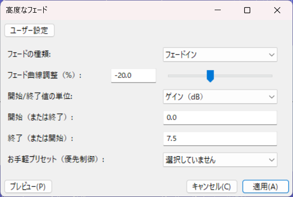
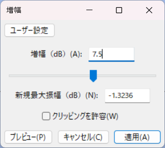

# 備考

## 「18 演劇部の特別レッスン～小さな部長と内気なジュリエット～」について
サントラから取り込んだファイルをそのままループさせると、末尾がどうしてもフェードアウト部分にかかってしまうため、違和感のないように音量を上げる必要があります。

Audacity を使って音量を上げる例を以下に示します。
### 1分47.081秒～1分51.191秒
メニューバーから「エフェクト」→「Steve Daulton」→「高度なフェード」を選択し、図のように高度なフェードをかける。

### 1分51.191秒～末尾
メニューバーから「エフェクト」→「音量と圧縮」→「増幅」を選択し、図のように増幅をかける。「新規最大振幅」は自動計算されるので無視してOK。

高度なフェードをかけた範囲と重複しないように注意。
高度なフェードをかけた後、メニューバーから「録音と再生」→「カーソル移動」→「選択範囲の最後へ」を選択し、1サンプル分後ろにずらせばOK。

